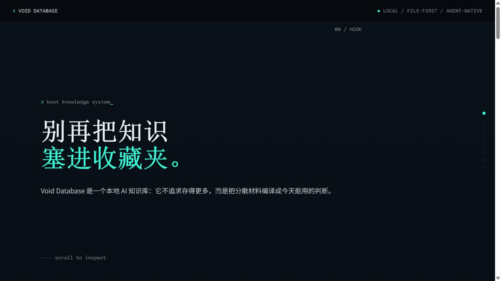
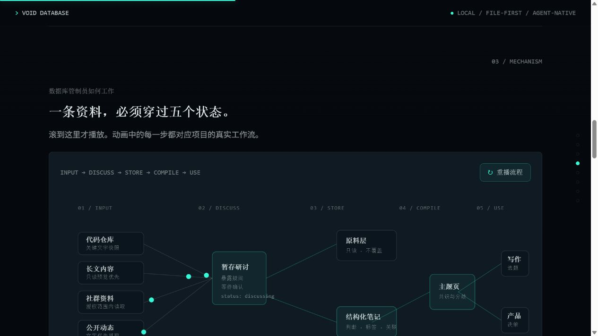

# 实战案例分享

这里仅展示 `html-exhibition` 的视觉效果、交互效果和两种工程结构，不作为案例内容本身的说明文档。





## 两种开发模式

### 单 HTML 模式

推荐入口：

```text
单HTML模式/void-database-single-file.html
```

[查看入口文件](./单HTML模式/void-database-single-file.html)

这个版本把 HTML、CSS、JS 全部放在一个文件中，适合简单项目、短展示、一次性交付和方便转发。

### 复杂结构模式（默认）

推荐入口：

```text
复杂结构模式/void-database-showcase.html
```

[查看入口文件](./复杂结构模式/void-database-showcase.html)

这个版本把语义结构、样式和交互拆分到不同文件，适合大项目、复杂概念动画和多轮对话迭代。虽然内部由多个文件组成，用户仍然只需要打开 `void-database-showcase.html`，全部章节、动画和交互都会正常加载。

```text
复杂结构模式/
├─ void-database-showcase.html    # 唯一展示入口
├─ styles/                        # 设计系统、版式、动效
├─ scripts/                       # 页面交互、概念动画
├─ brief.md                       # 展示约束与隐私边界
└─ AGENTS.md                      # 文件职责与工程约束
```

## 如何选择

| 模式 | 适合场景 | 维护方式 | 打开文件 |
|---|---|---|---|
| 单 HTML | 简单、短期、低频修改、单文件发送 | 所有内容集中在一个文件 | `void-database-single-file.html` |
| 复杂结构（默认） | 大项目、复杂交互、多轮迭代 | HTML/CSS/JS 分工明确 | `void-database-showcase.html` |

无论选择哪种模式，交付时都只有一个需要打开的语义化 HTML 入口，不使用 `index.html` 等默认文件名。
